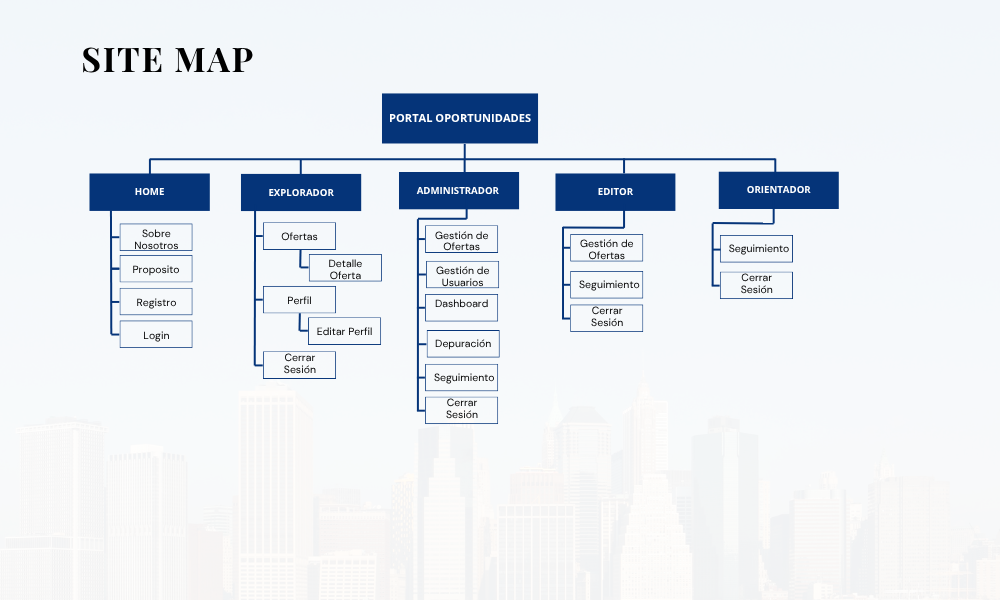

# Documentación – Portal de Oportunidades Fundacion Zoraida

> Plataforma web para conectar jóvenes de Sabana de Occidente con oportunidades educativas y laborales.

---

## Índice

1. [Introducción](#1-introducción)  
   - [1.1 Objetivo del documento](#11-objetivo-del-documento)
   - [1.2 Descripción general del proyecto](#12-descripción-general-del-proyecto)
2. [Fase 1 – Planeación y Diseño](#2-fase-1--planeación-y-diseño)  
   - [2.1 Documento de Alcance](#21-documento-de-alcance)
   - [2.2 Mapa del Sitio (Sitemap)](#22-mapa-del-sitio-sitemap)
   - [2.3 Historias de Usuario](#23-historias-de-usuario)
   - [2.4 Requisitos Funcionales y No Funcionales](#24-requisitos-funcionales-y-no-funcionales)
   - [ 2.5 Wireframes de Baja Fidelidad](#25-wireframes-de-baja-fidelidad)
   - [2.6 Especificación del Dashboard Administrativo](#26-especificación-del-dashboard-administrativo)
   - [2.7 Diagrama UML de Clases ](#26-diagrama-uml-de-clases)
   - [2.8 UX desing Figma ](#28-ux-design-en-figma)
   - [2.9 Guía de Estilos (UI Design System)](#29-guía-de-estilos-ui-design-system)
- [3. Fase 2 – Desarrollo](#3-fase-2--desarrollo)  
  - [3.1 Arquitectura del Sistema](#31-arquitectura-del-sistema)  
  - [3.2 Estructura de Carpetas](#32-estructura-de-carpetas)  
  - [3.4 Código Relevante](#34-código-relevante)
- [4. Fase 3 – Pruebas](#4-fase-3--pruebas)  
  - [4.1 Plan de Pruebas](#41-plan-de-pruebas)  
  - [4.2 Casos de Prueba](#42-casos-de-prueba)  
  - [4.3 Resultados y Bugs](#43-resultados-y-bugs)  
  - [4.4 Pruebas de Usuario (si se puede)](#44-pruebas-de-usuario-si-se-puede)
- [5. Fase 4 – Despliegue](#5-fase-4--despliegue)  
  - [5.1 Hosting y Entorno de Producción](#51-hosting-y-entorno-de-producción)  
  - [5.2 Pasos para Desplegar](#52-pasos-para-desplegar)  
  - [5.3 Consideraciones de Seguridad](#53-consideraciones-de-seguridad)
- [7. Anexos](#7-anexos)

---

## 1. Introducción

### 1.1 Objetivo del documento
> Explicar el desarrollo técnico y funcional del Portal de Oportunidades, desde la planeación hasta el despliegue final.

### 1.2 Descripción general del proyecto
> El Portal de oportunidades – Fundación Zoraida es una plataforma web diseñada para presentar ofertas académicas o laborales a jóvenes registrados en el sistema. Cada usuario cuenta con un perfil personal que permite realizar seguimiento individualizado a través de logs de navegación, facilitando el seguimiento y el análisis de comportamiento. Adicionalmente, el portal incluye un módulo administrativo destinado a la gestión de ofertas, la consulta de estadísticas relevantes y el monitoreo de la actividad de los usuarios, con el fin de realizar seguimientos efectivos que aumenten la probabilidad de aceptación a las ofertas.
 
---

## 2. Fase 1 – Planeación y Diseño

### 2.1 Documento de Alcance

####  Objetivo General

Desarrollar una plataforma web que permita presentar ofertas educativas y laborales a jóvenes previamente registrados, con mecanismos de trazabilidad que permitan hacer seguimiento individualizado según los intereses del usuario. El objetivo es **aumentar la retención y reducir la deserción en las etapas iniciales de las convocatorias**,  mediante un sistema de navegación medible y personalizable, y un módulo de administración con métricas clave para evaluación de impacto.

####  Objetivos Específicos

##### Generales
- Garantizar que la plataforma tenga un rendimiento óptimo, sin tiempos de carga excesivos.
- Asegurar el diseño responsivo que permita su uso tanto en computadores como en dispositivos móviles.
- Incluir una vista detallada para cada oferta con descripción, imagen y enlace externo.
- Generar un Dashboard administrativo que permita hacer seguimiento a los usuarios de acuerdo a los logs generados 

##### Desde el rol de Usuario
- Registrar nuevos usuarios y permitir su inicio de sesión.
- Permitir la edición del perfil individual.
- Redirigir al usuario a ofertas académicas o laborales externas o propias de la Fundación Zoraida.

##### Desde el rol de Administrador
- Crear nuevos usuarios con rol específico.
- Visualizar un dashboard con estadísticas de navegación obtenidas mediante logs.
- Generar reportes en pdf de las estadísticas generadas en un periodo específico de tiempo. 
- Crear nuevas ofertas a partir de un enlace externo, extrayendo título, imagen y descripción por defecto (editables).
- Visualizar los usuarios que han sido redireccionados a ofertas.
- Crear seguimientos a los usuarios por cada oferta redireccionada.
- Exportar datos de usuarios y ofertas incativas en formato csv.
- Depuración manual de usuarios y ofertas inactivas

---

####  Público Objetivo

El portal está dirigido a **jóvenes entre los grados 10° y 11°, y personas menores de 30 años**, interesados en oportunidades educativas o laborales.  
El público objetivo:
- Reside principalmente en **Bogotá y Sabana de Occidente**.
- Tiene acceso a **dispositivos tecnológicos con conexión a internet**.
- Cuenta con conocimientos básicos en tecnología: uso de redes sociales, navegación web, y correo electrónico.

La plataforma está optimizada para **uso desde computador**, pero tendrá diseño responsivo para **garantizar su uso desde dispositivos móviles**.

---

####  Funcionalidades Incluidas

- Registro e inicio de sesión de usuarios.
- Edición de perfil.
- Visualización y filtrado de ofertas laborales y académicas.
- Redirección externa a las plataformas que gestionan las convocatorias.
- Seguimiento a usuarios redirigidos a plataformas externas.
- Gestión de usuarios administrativos.
- Creación de ofertas mediante enlace, con extracción automática de datos.
- Dashboard administrativo con estadísticas.
- Generacion de reportes estadísticos en un periodo de tiempo específico en pdf.
- Registro de navegación (logs).
- Identificación de usuarios y ofertas inactivas. 
- Generación de reporte de depurado con los elementos inactivos en csv.
- Depurado manual de usuarios y ofertas inactivas 

####  Funcionalidades Excluidas

- Postulación directa a las ofertas desde el portal.
- Subida y gestión de archivos (ej: hojas de vida).
- Evaluación vocacional o test automatizado.
- Módulos de chat o interacción directa entre usuarios y admins.
- Seguimiento automatizado (El seguimiento lo realiza una persona y no hay mecanismos de retención inmediatos).
- Inicio de sesion con google o Facebook.

---

####  Restricciones de Negocio

- El desarrollo debe realizarse exclusivamente con **tecnologías gratuitas y de código abierto**.
- El portal debe poder **funcionar en un entorno de hosting compartido** sin requerimientos especiales.
- El sistema debe **funcionar en una sola instancia** (No se cuenta con Servidor).
- **No se permite el uso de herramientas o librerías externas que accedan o transmitan datos sensibles**, especialmente por el posible manejo de información de **menores de edad**.
- Se deben seguir principios de **protección de datos personales y privacidad** conforme a la legislación colombiana vigente.

---

####  Criterios de Aceptación

El sistema se considerará aceptable como MVP cuando cumpla con:

1. Registro, login y edición funcional de usuarios.
2. Visualización funcional de al menos 10 ofertas reales.
3. Trazabilidad de navegación (logs) funcionando.
4. Acceso administrativo con:
   - Panel de control básico con estadísticas de navegación por usuario, oferta y fechas.
   - Funcionalidad para crear nuevas ofertas a partir de un link.
   - Vista de usuarios redirigidos a una oferta (evento: redirección).
   - Registro de seguimientos hechos a usuarios.

Además, el sistema debe:

- Ser usable sin errores técnicos graves.
- Tener navegación clara, responsiva y sin bloqueos.
- Permitir realizar las tareas descritas sin necesidad de intervención externa.

El cumplimiento será validado mediante:

- **Pruebas funcionales automatizadas** 
- **Demostración a un miembro autorizado de la Fundación Zoraida**.

---

####  Cronograma Tentativo

| Fase               | Duración estimada | Fecha de inicio  | Fecha de fin  |
|--------------------|-------------------|------------------|---------------|
| Planeación         | 8 días            | 2025-07-07       | 2025-07-15    |
| Desarrollo  Back   |                    |      |     |
| Desarrollo  Front  | 5 días            |       |     |
| Pruebas            | 2 días            |        |   |
| Despliegue         | 1 día             |       |    |

---

### 2.2 Mapa del Sitio (Sitemap)
Este mapa de sitio representa la arquitectura de navegación propuesta del Portal de Oportunidades, diferenciando los flujos por tipo de usuario (Explorador, Editor, Orientador, Administrador) y agrupando las funcionalidades clave por módulo funcional.

 
### 2.3 Historias de Usuario

#### Rol: Explorador

- **HU01.** Como Explorador, quiero registrarme en el portal para poder acceder a las ofertas disponibles.
- **HU02.** Como Explorador, quiero iniciar sesión con mis credenciales para acceder a mi perfil personal.
- **HU03.** Como Explorador, quiero editar la información de mi perfil para mantener mis datos actualizados.
- **HU04.** Como Explorador, quiero navegar por un listado de ofertas laborales y educativas para explorar las oportunidades disponibles.
- **HU05.** Como Explorador, quiero aplicar filtros en el listado de ofertas para encontrar fácilmente las que se ajustan a mis intereses.
- **HU06.** Como Explorador, quiero visualizar el detalle de cada oferta para conocer su contenido.
- **HU07.** Como Explorador, quiero ser redirigido a la página oficial de la oferta para realizar el proceso de postulación directamente.
- **HU08.** Como Explorador, quiero que el sistema registre mis interacciones (clics, visitas a ofertas) para recibir seguimiento y asesoria en el futuro (implementación humana, no automatizada).

---

#### Rol: Administrador

- **HU09.** Como administrador, quiero iniciar sesión en el sistema para acceder al panel de control.
- **HU10.** Como administrador, quiero registrar nuevos usuarios con rol administrativo para delegar tareas de gestión del portal.
- **HU11.** Como administrador, quiero acceder a un dashboard con estadísticas basadas en los logs de navegación para tomar decisiones informadas.
- **HU12.** Como administrador, quiero generar reportes en pdf de estadísticas basadas en los logs de navegación para llevar un registro.
- **HU13.** Como administrador, quiero crear nuevas ofertas introduciendo un enlace externo, del cual se extraigan automáticamente el título, la imagen y una descripción por defecto.
- **HU14.** Como administrador, quiero editar los datos extraídos de una oferta para corregir o complementar la información si es necesario.
- **HU15.** Como administrador, quiero recibir una notificación cuando un usuario genere un evento de tipo REDIRECCION, para poder realizar seguimiento personalizado.
- **HU16.** Como administrador, quiero acceder al historial de interacciones de los usuarios (logs) para analizar su comportamiento y mejorar las estrategias de retención humana.
- **HU17.**  Como administrador quiero exportar los  datos en csv de usuarios y ofertas inactivas para poder llevar un registro historico de los datos 
- **HU18.**  Como administrador quiero eliminar los datos de usuarios y ofertas inactivas para no sobresaturar la base de datos.
- **HU19.**  Como administrador quiero ser alertado cuando la base de datos esta llegando a su límite para no sobrepasar los límites gratuitos.
- **HU20.** Como administrador quiero categorizar las ofertas mediante etiquetas para facilitar su organización y búsqueda.

#### Rol: Editor
- **HU09.** Como administrador, quiero iniciar sesión en el sistema para acceder al panel de control.
- **HU10.** Como administrador, quiero registrar nuevos usuarios con rol de explorador.
- **HU13.** Como administrador, quiero crear nuevas ofertas introduciendo un enlace externo, del cual se extraigan automáticamente el título, la imagen y una descripción por defecto.
- **HU14.** Como administrador, quiero editar los datos extraídos de una oferta para corregir o complementar la información si es necesario.
- **HU16.** Como administrador, quiero acceder al historial de interacciones de los usuarios (logs) para realizar seguimiento.
- **HU16.** Como administrador, quiero crear novedades en los seguimientos generados por los logs del usuario para llevar el registro del estado de la solicitud.
- **HU16.** Como administrador, quiero cambiar el estado de un seguimiento para poder segmentar los seguimientos activos e inactivos.
- **HU20.** Como administrador quiero categorizar las ofertas mediante etiquetas para facilitar su organización y búsqueda.

#### Rol: Orientador
- **HU09.** Como administrador, quiero iniciar sesión en el sistema para acceder al panel de control.
- **HU16.** Como administrador, quiero acceder al historial de interacciones de los usuarios (logs) para realizar seguimiento.
- **HU16.** Como administrador, quiero crear novedades en los seguimientos generados por los logs del usuario para llevar el registro del estado de la solicitud.
- **HU16.** Como administrador, quiero cambiar el estado de un seguimiento para poder segmentar los seguimientos activos e inactivos.

---

### 2.4 Requisitos Funcionales y No Funcionales

####  Requisitos Funcionales

| ID   | Descripción                                                                                       | Prioridad |
|------|---------------------------------------------------------------------------------------------------|-----------|
| RF01 | El sistema debe permitir el registro de nuevos usuarios.                                          | Alta      |
| RF02 | El sistema debe permitir el inicio de sesión de usuarios y administradores.                       | Alta      |
| RF03 | El usuario debe poder editar su información personal desde su perfil.                             | Alta    |
| RF04 | El usuario debe poder navegar y visualizar un listado de ofertas académicas y laborales.          | Alta      |
| RF05 | El usuario debe poder aplicar filtros para facilitar la búsqueda de ofertas.                      | Alta     |
| RF06 | El sistema debe mostrar una vista detallada de cada oferta.  | Alta      |
| RF07 | El sistema debe redirigir al usuario a la página externa oficial de la oferta al hacer clic en “Ver más”.  | Alta      |
| RF08 | El sistema debe “registrar automáticamente un log con usuario, oferta, fecha y tipo de evento (detalle o redirección). | Alta      |
| RF09 | El administrador debe poder acceder a un dashboard con estadísticas basadas en los logs.          | Media     |
| RF10| El administrador debe poder exportar las estadísticas en pdf generadas en un periodo de tiempo | Media | 
| RF11 | El administrador debe poder crear nuevos usuarios con un rol específico.                       | Media     |
| RF12 | El administrador debe poder crear nuevas ofertas a partir de un enlace externo.                   | Alta      |
| RF13 | El sistema debe extraer automáticamente título, imagen y descripción del enlace ingresado.        | Media      |
| RF14 | El administrador debe poder editar los datos extraídos de una oferta.                             | Alta    |
| RF16 | El administrador debe poder consultar logs de navegación por usuario.                             | Alta   |
|RF17 | El administrador debe poder identificar los usuarios y ofertas inactivas | Media|
| RF18 | El administrador debe poder eliminar de forma manual los usuarios y ofertas inactivas |  Media | 
|RF19  | El administrador debe poder exportar en csv los datos de los usuarios y ofertas a eliminar  | Baja |
|RF20  | El administrador debe recibir una alarma cuando la base de datos este llegando a su límite  |  Alta |
RF21|	El dashboard debe mostrar métricas agrupadas por oferta, usuario y tiempo, con visualizaciones gráficas que permitan analizar tendencias. |	Baja |

---

#### Requisitos No Funcionales

| ID   | Categoría       | Descripción                                                                                | Prioridad |
|------|------------------|----------------------------------------------------------------------------------------------|-----------|
| RNF01 | Rendimiento      | El sistema debe cargar cada vista en menos de 5 segundos bajo condiciones normales.         | Alta      |
| RNF02 | Seguridad        | El sistema debe proteger los datos personales según la Ley 1581 de 2012 (Colombia).         | Alta      |
| RNF03 | Seguridad        | No se debe permitir que librerías externas accedan a datos de usuario.                      | Alta      |
| RNF04 | Seguridad        | Las contraseñas deben almacenarse cifradas.                                                 | Alta      |
| RNF05 | Compatibilidad   | El sistema debe funcionar correctamente en navegadores modernos (Chrome, Firefox, Edge).    | Alta      |
| RNF06 | Compatibilidad   | El diseño debe ser responsivo para permitir el uso desde dispositivos móviles.              | Alta      |
| RNF07 | Mantenibilidad   | El código debe seguir una estructura modular, clara y documentada.                          | Media     |
| RNF08 | Escalabilidad    | El sistema debe permitir agregar nuevas funcionalidades en el futuro sin reescribir todo.  | Alta     |
| RNF09 | Disponibilidad   | El sistema debe estar disponible en línea 24/7 desde hosting compartido.                   | Alta      |
| RNF10 | Accesibilidad    | El sistema debe tener texto alternativo en imágenes y buena jerarquía visual.              | Media     |
| RNF11 | Legal            | El sistema debe gestionar el consentimiento de uso de datos para usuarios menores de edad. | Alta      |

### 2.5 Especificación del Dashboard Administrativo

El dashboard es una interfaz exclusiva para usuarios con rol administrador. Su propósito es permitir la visualización, análisis y exportación de estadísticas del sistema basadas en los logs de navegación y datos registrados.

#### Secciones del Dashboard

**1. Panel de estadísticas generales**
- Total de usuarios registrados
- Total de ofertas activas
- Usuarios por genero 

**2. Métricas por oferta**
- Número de visualizaciones por oferta
- Número de redirecciones por oferta
- Tasa de redirección
- Gráfica de comportamiento por oferta

**3. Métricas por usuario**
- Cantidad de ofertas visualizadas
- Cantidad de redirecciones
- Última fecha de actividad
- Acceso a historial de logs

**4. Métricas temporales**
- Gráfico de interacciones por día, semana o mes
- Nuevos registros por semana
- Comparativas entre periodos

**5. Métricas de comportamiento agregado**
- Ofertas más vistas / menos vistas
- Porcentaje de usuarios sin redirecciones

**6. Acciones disponibles**
- Exportar reporte PDF de estadísticas
- Descargar CSV de datos a depurar
- Filtros por periodo de tiempo
- Filtros por categoría de oferta
  
**Acciones avanzadas:**
- Actualizar métricas en tiempo real o por intervalo 
- Cálculo automático de tasas: redirección / visualización
  
### 2.6 Diagrama UML de Clases
Este diagrama representa las entidades principales del sistema, sus relaciones y la lógica de negocio mediante servicios auxiliares (ReportService, SecurityService y CleanupService). Refleja los requisitos funcionales y no funcionales descritos en esta documentación. Los métodos mostrados en las clases indican funcionalidades esperadas o implementadas para el correcto funcionamiento del portal web.
 

#### Descripcion de Clases

##### `Usuario`
> Representa a un usuario registrado en el sistema. Puede tener diferentes roles según su nivel de acceso y funciones: Administrador, Editor, Orientador, o Explorador (usuario regular). El modelo centraliza la información personal, de contacto, autenticación y permisos de acceso.

**Atributos**
| Atributo                 | Tipo            | Descripción / Comentarios                              |
| ------------------------ | --------------- | ------------------------------------------------------ |
| `id`                     | `int`           | Identificador único del usuario                        |
| `nombre`                 | `str`           | Nombre completo                                        |
| `tipo_documento`         | `TipoDocumento` | Enum: CC, TI, CE, PAS.                                 |
| `num_documento`          | `str`           | Número de documento de identidad                       |
| `fecha_nacimiento`       | `date`          | Fecha de nacimiento                                    |
| `genero`                 | `Genero`        | Enum: Masculino, Femenino, No binario, Otro,  Prefiere no decir     |
| `lugar_residencia`       | `Residencia`    | Enum: Madrid, Funza, Mosquera, Facatativa, Bojacá, Zipacon, El Rosal, Subachoque, Bogotá   |
| `direccion`              | `str`           | Dirección de residencia                                     |
| `telefono`               | `str`           | Número de contacto                                          |
| `email`                  | `str`           | Correo electrónico  |
| `contrasena`             | `Hash`          | Contraseña cifrada (hash, no texto plano)                   |
| `rol`                    | `Rol`           | Enum: Explorador, Administrador, Editor, Orientador.        |
| `consentimiento_menores` | `bool`          | Solo requerido si el usuario es menor de edad               |

**Métodos**
| Método                 | Retorno         | Descripción                             |
| ---------------------- | --------------- | --------------------------------------- |
| `+createUser()`        | `Usuario`       | Crea un nuevo usuario                   |
| `+readUserProfile()`   | `Usuario`       | Consulta el perfil completo del usuario |
| `+updateUserProfile()` | `void`          | Edita la información del perfil         |
| `+updatePassword()`    | `void`          | Cambia la contraseña                    |
| `+deleteUser()`        | `void`          | Desactiva el usuario                    |
| `+getUserType()`       | `str`           | Retorna el tipo de rol del usuario      |
| `+readAllUsers()`      | `List<Usuario>` | Devuelve todos los usuarios registrados |

---

##### `Log`
> Representa un registro de eventos de navegación realizados por los usuarios dentro del sistema. Incluye acciones como inicio de sesión, visualización del detalle de una oferta, y redirección externa hacia la página de la oferta. Este modelo permite realizar trazabilidad del comportamiento del usuario con fines analíticos y de seguimiento.

**Atributos**
| Atributo  | Tipo        | Descripción                                                  |
| --------- | ----------- | ------------------------------------------------------------ |
| `id`      | `int`       | Identificador único del evento de log                        |
| `usuario` | `Usuario`   | Referencia al usuario que ejecutó la acción                  |
| `oferta`  | `Oferta`    | (Opcional) Referencia a la oferta sobre la que se interactuó |
| `evento`  | `EventoLog` | Enum: Inicio Sesión, Detalle, Redirección                    |
| `fecha`   | `datetime`  | Fecha en que ocurrió el evento                               |

**Métodos**
| Método                        | Retorno     | Descripción                                                       |
| ----------------------------- | ----------- | ----------------------------------------------------------------- |
| `+createLogEvent()`           | `Log`       | Registra un nuevo evento de navegación                            |
| `+readLog()`                  | `Log`       | Consulta un log individual                                        |
| `+getLogsByUser(userId: int)` | `List<Log>` | Obtiene todos los logs asociados a un usuario                     |
| `+getLogsByOfferAndDate()`    | `List<Log>` | Consulta los logs filtrados por oferta y rango de fechas          |
| `+readAllLogs()`              | `List<Log>` | Devuelve todos los registros del sistema (según permisos del rol) |

---

##### `Oferta`
> Representa una oportunidad académica o laboral publicada en el portal. Una oferta puede ser de tipo Empleo, Práctica, Curso, Beca o Educación . Se tomó la decisión de modelar todos los tipos de oferta dentro de una única entidad para reducir la complejidad estructural del modelo y facilitar las consultas, dado que no se requiere lógica específica por tipo de oferta. 

**Atributos**
| Atributo              | Tipo            | Aplicabilidad                                               |
| --------------------- | --------------- | ----------------------------------------------------------- |
| `id`                  | `int`           | General                                                     |
| `institucion`         | `str`           | General                                                     |
| `titulo`              | `str`           | General                                                     |
| `imagen`              | `str`           | General                                                     |
| `descripcion`         | `str`           | General                                                     |
| `fecha_inicio`        | `date`          | General                                                     |
| `fecha_fin`           | `date`          | General                                                     |
| `tipo_oferta`         | `TipoOferta`    | General (enum)                                              |
| `link`                | `str`           | General                                                     |
| `estado`              | `bool`          | General                                                     |
| `lugar`               | `str`           | General                                                     |
| `rango_salarial`      | `str`           | Empleo / Prácticas                                          |
| `tipo_contrato`       | `TipoContrato`  | Empleo / Prácticas (`aprendizaje` por defecto en prácticas) |
| `auxilio`             | `bool`          | Prácticas / Becas                                           |
| `duracion`            | `str`           | Prácticas / Cursos / Educación                              |
| `modalidad`           | `Modalidad`     | Cursos / Educación (enum)                                   |
| `duracion_presencial` | `str`           | Cursos o Educación híbrida                                  |
| `duracion_virtual`    | `str`           | Cursos o Educación híbrida                                  |
| `tipo_formacion`      | `TipoEducacion` | Educación (enum)                                            |

**Métodos**
| Método                           | Retorno        | Descripción                                                  |
| -------------------------------- | -------------- | ------------------------------------------------------------ |
| `+createOffer()`                 | `Oferta`       | Crea una nueva oferta en el sistema                          |
| `+readOffer()`                   | `Oferta`       | Consulta la información de una oferta específica             |
| `+updateOffer()`                 | `void`         | Edita los datos de una oferta existente                      |
| `+deleteOffer()`                 | `void`         | Marca la oferta como inactiva                                |
| `+isActive()`                    | `bool`         | Devuelve `True` si la oferta está vigente                    |
| `+getAssociatedLogs()`           | `List<Log>`    | Devuelve los logs relacionados con la oferta                 |
| `+getOfferDataFromUrl(url: str)` | `Oferta`       | Extrae datos automáticamente desde una fuente externa        |
| `+readAllOffers()`               | `List<Oferta>` | Lista todas las ofertas activas o archivadas según el estado |

---

##### `Seguimiento`
> Representa el control manual del estado y evolución de un usuario dentro del sistema. Este modelo es gestionado por perfiles de tipo analista/orientador y permite mantener el historial del proceso de acompañamiento del usuario.

**Atributos**
| Atributo             | Tipo                | Descripción                                                            |
| -------------------- | ------------------- | ---------------------------------------------------------------------- |
| `usuario`            | `Usuario`           | Referencia al usuario al que se le realiza seguimiento                 |
| `fecha`              | `date`              | Fecha en la que se registró el seguimiento                             |
| `estado`             | `EstadoSeguimiento` | Enum: Pendiente, En Proceso, Finalizado, Cancelado                     |
| `seguimiento_activo` | `bool`              | Indica si este seguimiento es el actual (activo) o parte del historial |

**Métodos**
| Método                                                | Retorno             | Descripción                                     |
| ----------------------------------------------------- | ------------------- | ----------------------------------------------- |
| `+createTracking(usuario: Usuario)`                   | `Seguimiento`       | Crea un nuevo proceso de seguimiento            |
| `+readTracking()`                                     | `Seguimiento`       | Consulta un seguimiento específico              |
| `+updateTrackingStatus(newStatus: EstadoSeguimiento)` | `void`              | Actualiza el estado del seguimiento actual      |
| `+isTrackingActive()`                                 | `bool`              | Retorna si el seguimiento está en estado activo |
| `+getTrackingsByStatus(status: EstadoSeguimiento)`    | `List<Seguimiento>` | Lista seguimientos por estado                   |
| `+readAllTrackings()`                                 | `List<Seguimiento>` | Devuelve todos los seguimientos registrados     |

---

##### `Novedad`
> Representa una observación o anotación específica realizada dentro de un proceso de seguimiento de un usuario. Cada Novedad está asociada a un Seguimiento.

**Atributos**
| Atributo      | Tipo             | Descripción                                           |
| ------------- | ---------------- | ----------------------------------------------------- |
| `id`          | `int`            | Identificador único de la novedad                     |
| `fecha`       | `date`           | Fecha de creación de la novedad                       |
| `descripción`   | `str`            | Texto libre que describe la observación registrada    |
| `creado_por`  | `Usuario`        | Usuario con rol administrativo que realizo el seguimiento    |

**Métodos**
| Método                                                    | Retorno         | Descripción                                     |
| --------------------------------------------------------- | --------------- | ----------------------------------------------- |
| `+createTrackingNote(seguimiento: Seguimiento, ...)`      | `Novedad`       | Crea una nueva novedad dentro de un seguimiento |
| `+readTrackingNote()`                                     | `Novedad`       | Consulta el contenido de una novedad específica |
| `+updateTrackingNote(newContent: str, tipo: TipoNovedad)` | `void`          | Edita el contenido o tipo de una novedad        |
| `+readAllNotesByTracking(trackingId: int)`                | `List<Novedad>` | Lista todas las novedades de un seguimiento     |

---
##### `Tag`
> Representa una etiqueta o palabra clave que se utiliza para clasificar y organizar las ofertas del portal. Las etiquetas permiten agrupar ofertas por áreas de conocimiento,

**Atributos**
| Atributo | Tipo  | Descripción                                             |
| -------- | ----- | ------------------------------------------------------- |
| `id`     | `int` | Identificador único de la etiqueta                      |
| `nombre` | `str` | Nombre de la etiqueta (debe ser único y representativo) |

**Métodos**
| Método                    | Retorno        | Descripción                                         |
| ------------------------- | -------------- | --------------------------------------------------- |
| `+createTag(nombre: str)` | `Tag`          | Crea una nueva etiqueta                             |
| `+readTag()`              | `Tag`          | Consulta los datos de una etiqueta específica       |
| `+updateTag(nombre: str)` | `void`         | Actualiza el nombre de una etiqueta                 |
| `+deleteTag()`            | `void`         | Elimina (o desactiva) una etiqueta del sistema      |
| `+getTaggedOffers()`      | `List<Oferta>` | Devuelve las ofertas relacionadas con esta etiqueta |
| `+readAllTags()`          | `List<Tag>`    | Lista todas las etiquetas existentes                |

---

##### `Reporte` _(Clase Abstracta)_
> Clase base que representa la estructura común de todos los reportes generados en el sistema. No se instancia directamente; sirve como plantilla para heredar atributos y métodos comunes.

**Atributos**
| Atributo         | Tipo      | Descripción                                                       |
| ---------------- | --------- | ----------------------------------------------------------------- |
| `id`             | `int`     | Identificador único del reporte                                   |
| `fecha_generado` | `date`    | Fecha en la que se generó el reporte                              |
| `generado_por`   | `Usuario` | Usuario con permisos administrativos que solicitó el reporte      |
| `periodo_inicio` | `date`    | Fecha de inicio del período consultado                            |
| `periodo_fin`    | `date`    | Fecha de fin del período consultado                               |
| `url`            | `str`     | Ruta de descarga o consulta del archivo generado (PDF o CSV) |

**Métodos**
| Método        | Retorno | Descripción                                            |
| ------------- | ------- | ------------------------------------------------------ |
| `+generate()` | `void`  | Método abstracto para generar el contenido del reporte |

---

##### `InformeDepurado` → hereda de `Reporte`
> Reporte que consolida información eliminada o archivada en el sistema, con fines de depuración y trazabilidad. Útil para auditorías internas o respaldo previo a procesos de limpieza de datos.

**Atributos**
| Atributo                | Tipo                | Descripción                                     |
| ----------------------- | ------------------- | ----------------------------------------------- |
| `registros_usuarios`    | `List<Usuario>`     | Lista de usuarios inactivos                    |
| `registros_ofertas`     | `List<Oferta>`      | Lista de Ofertas inactivas                     |
| `registros_logs`        | `List<Log>`         | Lista de logs relacionados a un usuario inactivo               |
| `registros_seguimiento` | `List<Seguimiento>` | Lista de Seguimiento relacionados a un usuario inactivo   |
| `registros_novedades` | `List<Novedad>` | Lista de Novedades relacionadas a un seguimiento relacionado a un usuario inactivo | 

**Métodos**
| Método         | Retorno | Descripción                       |
| -------------- | ------- | --------------------------------- |
| `+exportCSV()` | `void`  | Exporta el reporte en formato CSV |

---

##### `InformeEstadistico` → hereda de `Reporte`
> Reporte extendido que consolida todas las métricas y visualizaciones del dashboard administrativo. Incluye estadísticas generales, comportamientos por usuario y oferta, comparativas temporales, y cálculos agregados. Está diseñado para exportación en PDF y admite filtros personalizados por tiempo.

| Categoría                        | Atributo                        | Tipo                        | Descripción                                          |
| -------------------------------- | ------------------------------- | --------------------------- | ---------------------------------------------------- |
|  **1. Estadísticas Generales** | `usuarios_registrados`          | `int`                       | Total de usuarios del sistema                          |
|                                  | `ofertas_activas`               | `int`                       | Total de ofertas actualmente activas                 |
|                                  | `usuarios_por_genero`           | `Dict[Genero, int]`         | Conteo de usuarios por género                        |
|  **2. Métricas por Oferta**    | `visualizaciones_por_oferta`    | `Dict[Oferta, int]`         | Número de vistas por cada oferta                       |
|                                  | `redirecciones_por_oferta`      | `Dict[Oferta, int]`         | Número de redirecciones externas                     |
|                                  | `tasa_redireccion_por_oferta`   | `Dict[Oferta, float]`       | Ratio redirección / visualización por oferta         |
|                                  | `grafico_comportamiento_oferta` | `str` (URL o ruta imagen)   | Gráfico generado de interacciones por oferta         |
|  **3. Métricas por Usuario**   | `visualizaciones_por_usuario`   | `Dict[Usuario, int]`        | Número de vistas realizadas por cada usuario           |
|                                  | `redirecciones_por_usuario`     | `Dict[Usuario, int]`        | Redirecciones hechas por cada usuario                |
|                                  | `ultima_fecha_actividad`        | `Dict[Usuario, date]`       | Último día en que hubo actividad registrada          |
|                                  | `historial_logs_usuario`        | `Dict[Usuario, List[Log]]`  | Logs completos por usuario (opcional según filtros)  |
|  **4. Métricas Temporales**    | `interacciones_temporales`      | `Dict[str, int]`            | Total de interacciones por día / semana / mes          |
|                                  | `registros_nuevos_temporales`   | `Dict[str, int]`            | Nuevos usuarios por periodo (semana o mes)           |
|  **5. Métricas Agregadas**     | `ofertas_mas_vistas`            | `List[Oferta]`              | Ofertas con mayor número de vistas                     |
|                                  | `ofertas_menos_vistas`          | `List[Oferta]`              | Ofertas con menor número de vistas                   |
|                                  | `usuarios_sin_redirecciones`    | `List[Usuario]`             | Usuarios que no redirigieron a ninguna oferta        |
|  **6. Filtros y Acciones**     | `filtro_periodo`                | `Tuple[date, date]`         | Rango de fechas definido para el reporte               |

**Métodos**
| Método                            | Retorno | Descripción                                                                  |
| --------------------------------- | ------- | ---------------------------------------------------------------------------- |
| `+exportPDF()`                    | `void`  | Exporta el reporte completo en formato PDF (con gráficos y métricas)         |
| `+filtrarPorPeriodo(inicio, fin)` | `void`  | Ajusta todas las métricas al rango de fechas establecido                     |

---

####  Servicios del Sistema

##### `SecurityService`
> Servicio responsable de la autenticación de usuarios, validación de sesiones activas y gestión segura de contraseñas.

**Métodos**
| Método                                     | Retorno   | Descripción                                                                                  |
| ------------------------------------------ | --------- | -------------------------------------------------------------------------------------------- |
| `+authenticate(email: str, password: str)` | `Usuario` | Verifica las credenciales del usuario y retorna la instancia correspondiente si son válidas. |
| `+validateSession(token: str)`             | `bool`    | Verifica si el token de sesión actual es válido.                                             |
| `+hashPassword(password: str)`             | `str`     | Devuelve una versión cifrada de la contraseña usando hash seguro.                            |

---

##### `ReportService`
> Servicio encargado de generar estadísticas del sistema, informes analíticos y métricas del dashboard administrativo.

**Métodos**
| Método                         | Retorno              | Descripción                                                           |
| ------------------------------ | -------------------- | --------------------------------------------------------------------- |
| `+generateInitialStats()`      | `InformeEstadístico` | Genera un resumen inicial de métricas globales al iniciar el sistema. |
| `+generateDashboardData()`     | `Dict`               | Recolecta y estructura los datos del dashboard en tiempo real.        |
| `+generateDataCleanupReport()` | `InformeDepurado`    | Genera un informe sobre los registros eliminados o inactivos.         |
| `+checkDatabaseUsage()`        | `float`              | Retorna el porcentaje actual de uso de espacio en la base de datos.   |

---

##### `CleanupService`
> Servicio encargado de ejecutar rutinas de depuración sobre registros antiguos o inactivos, con el objetivo de optimizar el rendimiento y mantener la base de datos limpia.

**Métodos**
| Método                      | Retorno                | Descripción                                                     |
| --------------------------- | ---------------------- | --------------------------------------------------------------- |
| `+cleanOldOrInactiveData()` | `void`                 | Elimina o marca registros antiguos, obsoletos o inactivos.      |
| `+getInactiveItems()`       | `Dict[str, List[Any]]` | Devuelve una lista clasificada de usuarios y ofertas inactivas. |

### Diseño de la base de datos 
- Diagrama relacional 
- Decisones de diseño 

### 2.7 Wireframes de Baja Fidelidad

[Wireframes](../docs/Anexos/Wireframes.pdf) -> Pdf 
O ver anexo en la carpeta /docs/Anexos/Wireframes.pdf

### 2.8 UX Design en Figma 
El diseño de experiencia de usuario se desarrolló en Figma y se encuentra disponible en el archivo compartido llamado ' '. Ver Anexos

### 2.9 Guía de Estilos (UI Design System)

####  Paleta de Colores (HEX)

| Rol del color | Nombre     | Código HEX |
|---------------|------------|------------|
| Principal     | Azul Zoraida     | #053479   |
| Énfasis       | Naranja feo   | #FF7E00   |
| Secundario    | Morado suave     | #6B4EFF   |
| Fondo claro   | Gris neutro 1    | #F8F9FA   |
| Fondo oscuro  | Gris neutro 2    | #E5E7EB   |
| Texto base    | Negro       | #1F2937   |

---

####  Tipografías y Jerarquías Visuales

- **Títulos:** `Platypi`, serif
  - Peso: 600–800
  - Usos: encabezados principales (`h1`, `h2`, botones importantes)
  - Tamaños sugeridos: `text-4xl` (h1), `text-2xl` (h2)

- **Párrafos y texto secundario:** Montserrat`, sans-serif
  - Peso: 400–600
  - Usos: cuerpo de texto, botones secundarios, formularios
  - Tamaños sugeridos: `text-base` (normal), `text-sm` (ayudas, notas)

---

####  Componentes Base (con Tailwind)

- **Botones**
  - Primario: fondo azul `#053479`, texto blanco, hover más oscuro (`hover:bg-[#032E66]`)
  - Secundario: borde morado `#6B4EFF`, texto morado, fondo blanco, hover fondo morado claro
  - Acción: fondo naranja `#FF7E00`, texto blanco

- **Inputs**
  - Bordes redondeados (`rounded-lg`)
  - Espaciado interior (`px-4 py-2`)
  - Bordes azules en foco (`focus:ring-[#053479]`)
  - Etiquetas arriba en `text-sm` gris oscuro

- **Alertas**
  - Exito: fondo verde `bg-green-100`, borde `border-green-600`
  - Error: fondo rojo claro, ícono de advertencia
  - Info: fondo azul claro, ícono de información

- **Tarjetas**
  - Fondo blanco, sombra suave (`shadow-md`)
  - Bordes `rounded-2xl`
  - Padding interno (`p-6`)
  - Título (`text-xl`), subtítulo (`text-sm` gris), botón inferior

---

#### Pautas de Espaciado y Consistencia Visual

- **Margen general:** `max-w-screen-lg`, centrado en `mx-auto`
- **Padding exterior:** `px-4` para móviles, `px-8` en pantallas grandes
- **Espaciado entre secciones:** mínimo `mb-8`
- **Iconografía:** Estilo lineal (`Heroicons`, `Lucide`, o SVGs simples)
- **Sombra consistente:** usar `shadow-sm` para componentes pequeños, `shadow-md` para tarjetas y modales

Empleo -> 
Rango salario
Auxilio transporte BOlean
Auxilio Alimentacion Bolean
tipo de contratro

Practicas ->
salario / si / no /cuanto 
Auxilio Boolean
cantrato de aprendizaje -> por defecto 
duracion 

Curso ->
Modalidad Hibrida/virtual / presencial
duracion
si es Hibrida -> duracion presencial y duracion virtual 

Becas ->
Auxilio / boolean

Educacion ->
tipo Tecnico / tecnologo  profesional 

## 3. Fase 2 – Desarrollo

### 3.1 Arquitectura del Sistema
> Descripción del patrón usado (MVC), capas lógicas, y cómo se estructuró el backend/frontend.

### 3.2 Estructura de Carpetas
   

### 3.4 Código Relevante

## 4. Fase 3 – Pruebas

### 4.1 Plan de Pruebas

### 4.2 Casos de Prueba

| ID |Funcionalidad	| Entrada esperada |	Resultado esperado	| Estado |
|----|--------------|------------------|----------------------|--------|

### 4.3 Resultados y Bugs

### 4.4 Pruebas de Usuario (si se puede)

## 5. Fase 4 – Despliegue
### 5.1 Hosting y Entorno de Producción

### 5.2 Pasos para Desplegar
 migraciones, configuración del servidor, dominios, etc.

### 5.3 Consideraciones de Seguridad
CSRF, contraseñas hasheadas, uso de .env, backups, etc.

## 7. Anexos

│   ├── Wireframes.pdf
│   ├── UML-Dashboard.svg              # Imagen del diagrama UML exportado
│   ├── dashboard-metrics.xlsx         # Métricas estructuradas
│   ├── dashboard-walkthrough.md       # Guía visual paso a paso
│   ├── figma-link.md                  # Enlace y capturas del diseño visual
│   └── design-system.md               # Guía visual y técnica de los componentes
│
├── Diagramas/
│   └── uml-dashboard.puml             # Versión editable del UML (PlantUML)